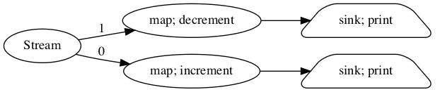
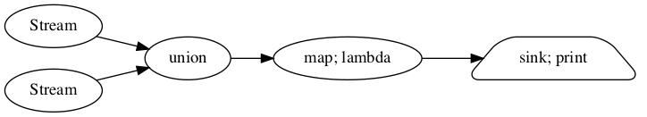

# 流计算

dask的实时任务提交接口非常适合做流处理,通过结合[streamz](https://github.com/python-streamz/streamz)我们可以构造复杂的流处理系统.


流处理常用于处理数据流,构造数据处理管道.具体的内容我们后面数据科学部分再说.

## 使用streamz做流处理

streamz的基本接口主要有如下几类:

###  基本的的流处理结构

+ `map(upstream, func, *args, **kwargs)`用于将流中的每个数据分发给处理函数;
+ `Stream.emit(self, x[, asynchronous])`用于将数据提交到流;
+ `sink(upstream, func, *args, **kwargs)`则将函数应用于每个结果.

一个最简单最基本的流处理单元如下:


```python
from streamz import Stream

def increment(x):
    return x**2 + 1

source = Stream()
source.map(increment).sink(print)

for i in range(10):
    source.emit(i)
```

    1
    2
    5
    10
    17
    26
    37
    50
    65
    82
    

### 设置缓冲区防止流堵塞

由于机器的性能或者短时间内大量数据的涌入,流处理可能会堵塞,我们可以使用`buffer(upstream, n, **kwargs)`来设置一个缓冲区,以应付这种情况.在上一个节点未能处理完之前如果有新的节点进来,那么它会被放在缓冲区.


```python
from streamz import Stream

def increment(x):
    return x**2 + 1

source = Stream()
source.buffer(100).map(increment).sink(print)

for i in range(10):
    source.emit(i)
```

    1
    2
    5
    10
    17
    26
    37
    50
    65
    82
    

### 积累状态

使用接口`accumulate(upstream, func[, start, …])`可以积累流中的状态,类似`reduce`操作


```python
from streamz import Stream

def increment(x):
    return x**2 + 1

def add(x,y):
    return x+y

source = Stream()
source.map(increment).accumulate(add).sink(print)

for i in range(10):
    source.emit(i)
```

    1
    3
    8
    18
    35
    61
    98
    148
    213
    295
    

### 操作流中元素

+ 确保唯一性

可以使用`unique(upstream[, maxsize, key, hashable])`保证流中元素唯一性,这个接口可以设置`maxsize`参数 用于控制这个唯一性的范围(最近多少条没有重复),重复的元素则会被过滤掉;而参数`key`和python中其他itertools一样用于确定不重复的键如何取到.


```python
source = Stream()
#source.unique(maxsize=1).sink(print)
source.unique(maxsize=4).sink(print)
for i in [1,2,3,2,3,2,2,4,5,6]:
    source.emit(i)
print("##################")
source = Stream()
source.unique(maxsize=1).sink(print)
for i in [1,2,3,2,3,2,2,4,5,6]:
    source.emit(i)
```

    1
    2
    3
    4
    5
    6
    ##################
    1
    2
    3
    2
    3
    2
    4
    5
    6
    

+ 过滤元素

可以使用`filter(upstream, predicate, *args, **kwargs)`来主动过滤一些符合条件的元素.


```python
source = Stream()
source.filter(lambda x: x%2 == 0).sink(print)
for i in range(10):
    source.emit(i)
```

    0
    2
    4
    6
    8
    

+ 将流数据压扁

类似spark中的flatten,`flatten()`也是一个功能,


```python
source = Stream()

source.flatten().sink(print)

for i in [[1, 2, 3], [4, 5], [6, 7, 7]]:
    source.emit(i)
```

    1
    2
    3
    4
    5
    6
    7
    7
    

+ 延迟处理

借助事件循环,我们可以使用`delay(upstream, interval, **kwargs)`接口来推迟执行的时间.


```python
source = Stream()
source.delay(1).filter(lambda x: x%2 == 0).sink(print)
for i in range(10):
    source.emit(i)
```

    0
    2
    4
    6
    8
    

+ 固定时间间隔执行

`rate_limit(upstream, interval, **kwargs)`可以实现这个功能,它可以用于平稳流的执行.


```python
import time
source = Stream()
source.rate_limit(interval=1).sink(print)
for i in range(10):
    source.emit(i)
```

    0
    1
    2
    3
    4
    5
    6
    7
    8
    9
    

### 截断缓存流

流处理一个很重要的功能就是计算序列中元素附近的一些统计量,这种时候截断与缓存就相当有用了.

+ 每隔一定数量截断流构建元素

`partition(upstream, n, **kwargs)` 可以实现这个功能,不过一旦停止,多出来的元素会被抛弃


```python
source = Stream()
source.partition(n=3).sink(print)
for i in range(10):
    source.emit(i)
```

    (0, 1, 2)
    (3, 4, 5)
    (6, 7, 8)
    

+ 将元素保存在缓存中

`streamz.collect(upstream, cache=None, **kwargs)`可以将流中的元素保存到缓存中,并在调用对象的`flush`时将它们作为集合发出并清空缓存.


```python
source1 = Stream()
source2 = Stream()
collector = source1.collect()
collector.sink(print)
source2.sink(collector.flush)
for i in range(10):
    source1.emit(i)
source2.emit('anything')
```

    (0, 1, 2, 3, 4, 5, 6, 7, 8, 9)
    

我们也可以设置`cache`参数,通常我们使用一个deque来限定缓存长度.外部定义的缓存也可以在流处理外部使用,这通常用于保存近期数据


```python
from collections import deque

cache = deque([],5)
source1 = Stream()
source2 = Stream()
collector = source1.collect(cache=cache)
collector.sink(print)
source2.sink(collector.flush)
for i in range(10):
    source1.emit(i)
    print(len(cache))
source2.emit('anything')
```

    1
    2
    3
    4
    5
    5
    5
    5
    5
    5
    (5, 6, 7, 8, 9)
    


```python
cache
```


    deque([])


+ 按元素个数窗口截断并缓存元素

`sliding_window(upstream, n, return_partial=True, **kwargs)`可以实现这个功能,它会保存当前元素和最近的(n-1)个元素组成tuple构成一个新的元素,参数`return_partial=True`意味着在流开始时,元素前面元素不足够的情况下也会被构成tuple.


```python
source = Stream()
source.sliding_window( n=3, return_partial=True).sink(print)
for i in range(10):
    source.emit(i)
```

    (0,)
    (0, 1)
    (0, 1, 2)
    (1, 2, 3)
    (2, 3, 4)
    (3, 4, 5)
    (4, 5, 6)
    (5, 6, 7)
    (6, 7, 8)
    (7, 8, 9)
    


```python
source = Stream()
source.sliding_window( n=3, return_partial=False).sink(print)
for i in range(10):
    source.emit(i)
```

    (0, 1, 2)
    (1, 2, 3)
    (2, 3, 4)
    (3, 4, 5)
    (4, 5, 6)
    (5, 6, 7)
    (6, 7, 8)
    (7, 8, 9)
    

+ 按时间窗口截断并缓存元素

`timed_window(upstream, interval, **kwargs)`可以实现这个功能.它与上面`sliding_window`不同之处就在于它是按时间截取,注意参数`interval`单位是秒.要注意一旦使用这个接口,它会启动一个事件循环来控制时间.


```python
import time
source = Stream()
source.timed_window( interval=3).sink(print)
for i in range(30):
    time.sleep(0.5)
    source.emit(i)
    
```

    []
    [0, 1, 2, 3, 4]
    [5, 6, 7, 8, 9, 10, 11]
    [12, 13, 14, 15, 16]
    [17, 18, 19, 20, 21, 22, 23]
    [24, 25, 26, 27, 28, 29]
    []
    []
    []
    

### 组合流

python有生成器本身其实已经有一定的流操作能力,那为什么要用`streamz`呢,用它更多的是为了构造复杂的流组合.在业务上流操作也时常需要组合,比如计算一个

#### 流分叉

我们的source对象可以用于构造流处理的计算图,


```python
def increment(x):
    return x + 1

def decrement(x):
    return x - 1

source = Stream()
a = source.map(increment).sink(print)
b = source.map(decrement).sink(print)
b.visualize(rankdir='LR')
```





```python
for i in range(5):
    source.emit(i)
```

    1
    -1
    2
    0
    3
    1
    4
    2
    5
    3
    

#### 流合并

+ `union(*upstreams, **kwargs)`将不同的流做合并操作


```python
source1 = Stream()
source2 = Stream()
view = source1.union(source2).map(lambda x: x**2).sink(print)
view.visualize(rankdir='LR')
```





```python
for i,j in zip(range(10),range(20,30)):
    source1.emit(i)
    source2.emit(j)
```

    0
    400
    1
    441
    4
    484
    9
    529
    16
    576
    25
    625
    36
    676
    49
    729
    64
    784
    81
    841
    

+ `combine_latest(*upstreams, **kwargs)`将不同流的最后两个元素组成tuple后合并,注意这个接口只要有一条流中有新数据传入就会触发计算


```python
source1 = Stream()
source2 = Stream()
source1.combine_latest(source2).sink(print)

for i,j in zip(range(10),range(20,30)):
    source1.emit(i)
    if j%2==0:
        source2.emit(j)
```

    (0, 20)
    (1, 20)
    (2, 20)
    (2, 22)
    (3, 22)
    (4, 22)
    (4, 24)
    (5, 24)
    (6, 24)
    (6, 26)
    (7, 26)
    (8, 26)
    (8, 28)
    (9, 28)
    

+ `zip(*upstreams, **kwargs)`将不同流按次序对齐并组成tuple,这个行为和python默认的zip一致,只是这个接口会丢弃无法对齐的数据


```python
source1 = Stream()
source2 = Stream()
source1.zip(source2).sink(print)

for i,j in zip(range(10),range(20,30)):
    source1.emit(i)
    if j%2==0:
        source2.emit(j)
```

    (0, 20)
    (1, 22)
    (2, 24)
    (3, 26)
    (4, 28)
    

+ `zip_latest(lossless, *upstreams, **kwargs)`这个接口会保证所有元素都被放出来,并且最长的一条不会重


```python
source1 = Stream()
source2 = Stream()
source1.zip_latest(source2).sink(print)

for i,j in zip(range(10),range(20,30)):
    source1.emit(i)
    if j%2==0:
        source2.emit(j)
```

    (0, 20)
    (1, 20)
    (2, 20)
    (3, 22)
    (4, 22)
    (5, 24)
    (6, 24)
    (7, 26)
    (8, 26)
    (9, 28)
    

#### 递归与反馈

`.connect(downstream)`和`.disconnect(downstream)`可以用于将流连接起来,这常用于构造递归与反馈循环,下面的例子我们构造一个流用于遍历我们的文件系统


```python
from streamz import Stream
from pathlib import Path
source = Stream()

my_path = source.unique()
my_path.sink(print)

def inner_dir(x):
    p = Path(x)
    return [str(i) for i in p.iterdir()]
        
content = my_path.filter(lambda x: Path(x).is_dir())
links = content.map(inner_dir).flatten()
links.connect(source)  # pipe new links back into pages

source.emit('./')
```

    ./
    分布式数据结构.ipynb
    .DS_Store
    mystream.png
    source
    source/collections-schedulers.png
    README.ipynb
    dask作为算力池.ipynb
    code
    code/.DS_Store
    code/streaming
    code/streaming/streaming_async.py
    code/realtime
    code/realtime/async_actor.py
    code/realtime/.vscode
    code/realtime/.vscode/settings.json
    code/realtime/async_submit.py
    实时任务提交.ipynb
    README.md
    .ipynb_checkpoints
    .ipynb_checkpoints/分布式数据结构-checkpoint.ipynb
    .ipynb_checkpoints/外部数据读取-checkpoint.ipynb
    .ipynb_checkpoints/README-checkpoint.ipynb
    .ipynb_checkpoints/流处理-checkpoint.ipynb
    .ipynb_checkpoints/dask作为算力池-checkpoint.ipynb
    .ipynb_checkpoints/实时任务提交-checkpoint.ipynb
    mydask.png
    流处理.ipynb
    服务化.ipynb
    

## 结合dask的实时流处理

最基础的流处理就是来一条处理一条的实时处理,这种模式模型最简单,但对系统的处理能力和网络io有较高要求,往往需要更多的资源.这个模式最知名的是storm框架.我们可以结合dask作为算力池直接利用集群算力来做实时流处理.


在streamz框架下,我们使用`scatter()`接口提交计算图,使用`gather()`接收流结果

### 同步写法


```python
def increment(x):
    """ A blocking increment function

    Simulates a computational function that was not designed to work
    asynchronously
    """
    time.sleep(0.1)
    return x + 1


def write(x):
    print(x)

```


```python
from dask.distributed import Client
client = Client("localhost:8786",processes=False) 
from streamz import Stream

source = Stream()
(source.scatter()       # scatter local elements to cluster, creating a DaskStream
       .map(increment)  # map a function remotely
       .buffer(5)       # allow five futures to stay on the cluster at any time
       .gather()        # bring results back to local process
       .sink(write))    # call write locally

for x in range(10):
    source.emit(x)
```

    1
    2
    3
    4
    5
    6
    7
    8
    9
    10
    

### 异步写法

异步写法下,`sink`接口的参数可以是一个协程函数


```python
%%writefile  code/streaming/streaming_async.py
import asyncio
import time
from dask.distributed import Client
from streamz import Stream


def increment(x):
    """ A blocking increment function

    Simulates a computational function that was not designed to work
    asynchronously
    """
    time.sleep(0.1)
    return x + 1


async def write(x):
    print(x)


async def f():
    client = await Client("localhost:8786", processes=False, asynchronous=True)
    source = Stream(asynchronous=True)
    source.scatter().map(increment).rate_limit('500ms').gather().sink(write)

    for x in range(10):
        await source.emit(x)

if __name__ == '__main__':
    asyncio.get_event_loop().run_until_complete(f())
```

    Overwriting code/streaming/streaming_async.py
    

## 批处理

更加常见的场景是使用流做批处理,我们当然可以直接使用上面的数据截断缓存方法来构造批数据,然后使用python函数处理.但显然这并不高效优雅.

另一种方式则是使用streamz提供的两种流数据结构


### batch结构


batch结构用于构造由python数组组成的批数据,


```python
from dask.distributed import Client
import json
from streamz import Stream
client = Client("localhost:8786",processes=False) 
stream = Stream()
example = [{'name': 'Alice', 'x': 1, 'y': 2}]
batch = stream.to_batch(example=example)
batch.stream.scatter().map(json.dumps).gather().sink(print)

batch.emit(example)
```

    [{"name": "Alice", "x": 1, "y": 2}]
    

### dataframe结构,借助pandas,dask,甚至cupy


```python
import pandas as pd
from streamz import Stream
from streamz.dataframe import DataFrame
stream = Stream()
df_sample = pd.DataFrame({'x': [1, 2, 3], 'y': [4, 5, 6]})
sdf = DataFrame(example=df_sample, stream=stream)

L = sdf.stream.scatter().map(lambda x: x["x"]**2+3).gather().sink(print)

sdf.emit(df_sample)
```

    0     4
    1     7
    2    12
    Name: x, dtype: int64
    

dataframe只能处理结构化数据,这个例子中我们首先使用pandas构造了一个dataframe的Scheme(设计方案),`df_sample`,后续的所有使用`emit`传入的dataframe就固定好了从流中解析出的是这个样式.这个例子可以看出我们可以构造数据类型`dataframe`来做批处理,但如何构造批呢?

### 将流构造为批进行批处理

我们可以一批一批的处理数据了,但流并不会自己成为批数据,这时候我们就可以使用前面提到的`截断缓存流`数据的方法构造批数据了.这边以`partition`方法为例.

下面的例子的过程如下:

1. 我们使用`partition(5)`将流截断缓存为3个一组,再将这5个一组的流转换为批对象,接着将批对象转换为dataframe,然后用dataframe的接口求取每5个的value字段的均值.这定义了流数据批处理的整个过程

2. 在构造好这个处理流程后,我们提出流程的`stream`对象,定义它的数据提交,收集和下沉过程.

3. 最后我们向流对象中喂入数据.


```python
import pandas as pd
import random
from streamz import Stream
from dask.distributed import Client
from streamz.dataframe import DataFrame
# 定义流
client = Client("localhost:8786",processes=False) 
stream = Stream()

# 定义批处理过程
keys = ["a","b","c"]
batch_sample = [{'key': "a", 'value': 20}]
batch = stream.partition(5).to_batch(example=batch_sample)
sdf = batch.to_dataframe()
process = sdf.value.mean()

# 定义数据提交,收集,下沉过程
process.stream.scatter().gather().sink(print)

# 向流中注入数据
for i in range(100):
    stream.emit({"key":random.choice(keys),"value":random.randint(20,100)})
```

    64.8
    65.5
    67.53333333333333
    65.8
    64.84
    68.76666666666667
    71.2
    70.75
    68.31111111111112
    66.8
    65.89090909090909
    65.71666666666667
    65.8
    66.48571428571428
    64.88
    63.675
    64.0
    64.17777777777778
    63.61052631578947
    63.11
    
