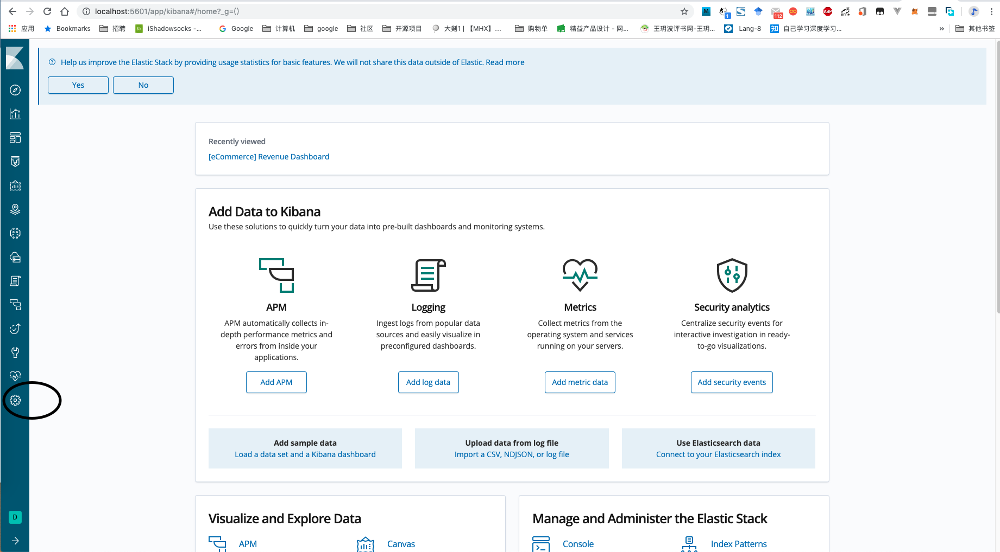
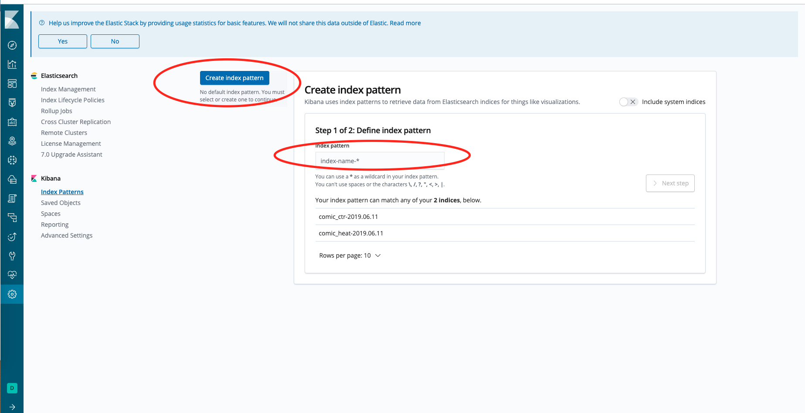
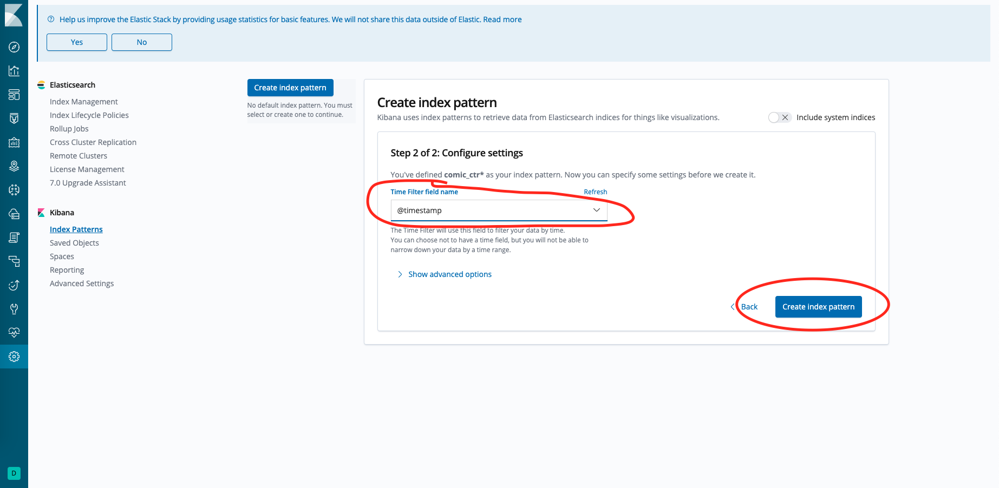

# 日志数据采集

log数据一般是整个后台都需要记录的东西,用于错误分析和负载分析,从而为架构师优化架构提供数据支持.比较常见的技术是`ELK`即

+ ElasticSearch 用于存储和查询日志数据
+ logstash/fluentd/filebeat用于收集日志数据
+ Kibana 用于作为日志分析和查询的交互界面

在使用docker的条件下,我们可以使用[log-pilot](https://github.com/AliyunContainerService/log-pilot)来快速部署`ELK`,这是一个阿里开源出来的日志采集系统,支持配置化部署可以选择使用`fluentd`或者`filebeat`,跟具收集器的不同也支持输出到其他除ES外的工具上.个人更加推荐`filebeat`,毕竟性能更好,资源占用更低.

需要注意,目前的默认镜像使用的filebeat版本过低不支持es7.0+,可以修改项目下的dockerfile文件重新打包镜像或者干脆使用es6.0+


## 在swarm上部署


log-pilot默认不支持的swarm,但我们可以在每个节点上不用swarm模式部署log-pilot,这样也可以实现在swarm集群上做日志收集,最简单的执行命令

```bash
sudo docker run --rm -it \
   -v /var/run/docker.sock:/var/run/docker.sock \
   -v /etc/localtime:/etc/localtime \
   -v /:/host:ro \
   --cap-add SYS_ADMIN \
    -e LOGGING_OUTPUT=elasticsearch \
    -e ELASTICSEARCH_HOST=${ELASTICSEARCH_HOST} \
    -e ELASTICSEARCH_PORT=${ELASTICSEARCH_PORT} \
   registry.cn-hangzhou.aliyuncs.com/acs/log-pilot:0.9.7-filebeat

```

## 使用方法

使用的时候只要使用对应的方式写上labels即可,例子如下:

```yml
version: '3.2'
services:
 
  xxx:
    image: xxx
    labels:
      - aliyun.logs.xxx=stdout ##注意就是这行
      - aliyun.logs.xxx.format=json
      - aliyun.logs.xxx-access=/usr/local/tomcat/logs/localhost_access_log.*.txt

    logging:
      driver: json-file # 这个是默认的可以不写
      options:
          max-size: "10m"
          max-file: "5"

    ...

    
    command: xxx

```

### label说明

可以在应用容器上添加多个标签以定义log的收集方式

> 指定收集的log位置

xxx指代项目名,`log-pilot`可以收集stdout或者指定路径上的log文件上的信息.如果是指定文件路劲,则必须是文件或者用通配符指定的多个文件,不能是文件夹.

> 指定log格式
`quant-online.logs.$name.format`为日志格式，这个格式为要收集的日志的格式，不是收集后变成的格式目前支持以下格式.

+ none：无格式纯文本。
+ json：json 格式，每行一个完整的 json 字符串。
+ csv：csv 格式。

> 添加log标签

`quant-online.logs.$name.tags`,上报日志时，额外增加的字段，格式为 k1=v1,k2=v2，每个 key-value 之间使用逗号分隔，例如: 

```shell
quant-online.logs.access.tags="name=hello,stage=test"
```
上报到存储的日志里就会出现 name 字段和 stage 字段.如果使用 ElasticSearch 作为日志存储，target 这个 tag 具有特殊含义，表示 ElasticSearch 里对应的 index.标签用于区分环境

### logging说明

为了限制docker容器本身的log不过度增长,可以使用这个字段做设置,其中driver表示收集的日志驱动,一般可以不填,主要是通过如下配置限制log文件规模
```yaml
options:
  max-size: "10m"
  max-file: "5"
```

如果使用json个是则需要填driver这个字段


## log调出

查看日志有两种方案:

+ 调用kibana查看
+ 调用docker的api查看

推荐使用第一种方式,第二种可以作为备选方案

## 调用kibana查看

进入kibana,按下图管理索引,



如果之前没有索引,则可以如下图这样新建一个




有索引后就可以在如下位置查看log了


左侧可以选择要展示的key,也可以通过搜索栏搜索需要的log
