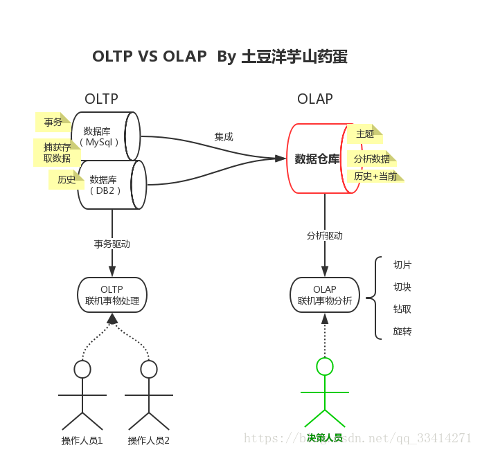

# OLTP与OLAP

数据处理大致可以分成两大类:

+ 联机事务处理OLTP(on-line transaction processing)
+ 联机分析处理OLAP(On-Line Analytical Processing)

## OLTP

OLTP是主要应用于业务数据存储,主要是基本的,日常的事务处理,例如银行交易.强调数据库内存效率,强调内存各种指标的命令率,强调绑定变量,强调并发操作.

OLTP场景下单次查询读写数据量少,但DML频繁,并行事务处理多,但是一般都很短.典型的操作是增删改查操作.

OLTP系统最容易出现瓶颈的地方就是CPU与磁盘子系统.

1. `CPU` cpu出现瓶颈常表现在逻辑读总量与计算性函数或者是过程上,逻辑读总量等于单个语句的逻辑读乘以执行次数,如果单个语句执行速度虽然很快,但是执行次数非常多,那么也可能会导致很大的逻辑读总量.设计的方法与优化的方法就是减少单个语句的逻辑读,或者是减少它们的执行次数.另外,一些计算型的函数如自定义函数,decode等的频繁使用也会消耗大量的CPU时间,造成系统的负载升高.正确的设计方法或者是优化方法需要尽量避免计算过程,如保存计算结果到统计表就是一个好的方法.
2. `磁盘子系统` 在OLTP环境中,它的承载能力一般取决于它的IOPS处理能力.因为在OLTP环境中磁盘物理读一般都是`db file sequential read`,也就是单块读,但是这个读的次数非常频繁.如果频繁到磁盘子系统都不能承载其IOPS的时候,就会出现大的性能问题.
OLTP比较常用的设计与优化方式为Cache技术与B-tree索引技术,Cache决定了很多语句不需要从磁盘子系统获得数据.另外在索引使用方面,语句越简单越好,这样执行计划也稳定,而且一定要减少语句解析,尽量减少表关联,尽量减少分布式事务,基本不使用分区技术,MV技术,并行技术及位图索引.因为并发量很高,批量更新时要分批快速提交,以避免阻塞的发生.

## OLAP

OLA主要应用于数据分析,支持复杂的分析操作,侧重决策支持,并且提供直观易懂的查询结果.强调数据分析,强调SQL执行时长,强调磁盘I/O,强调分区等.

OLAP场景下单次查询读写数据量大，但DML少,并行事务处理少,但是一般都很长.典型的操作是全表扫描,复杂长查询,长事务.

在OLAP系统中,常使用分区技术,并行技术.

分区技术在OLAP系统中的重要性主要体现在数据库管理上,比如数据库加载,可以通过分区交换的方式实现,备份可以通过备份分区表空间实现,删除数据可以通过分区进行删除,至于分区在性能上的影响,它可以使得一些大表的扫描变得很快(只扫描单个分区).另外如果分区结合并行的话也可以使得整个表的扫描会变得很快.总之分区主要的功能是管理上的方便性,它并不能绝对保证查询性能的提高,有时候分区会带来性能上的提高有时候会降低.

并行技术更多的是提高cpu利用率,一些无法并行的语句并不会因为这个技术提高性能.在OLAP系统中可以大量使用位图索引,物化视图,对于大的事务,尽量寻求速度上的优化,没有必要像OLTP要求快速提交,甚至要刻意减慢执行的速度.

## 分开设计与优化

在数据库设计上要特别注意,如在高可用的OLTP环境中不要盲目的把OLAP的技术拿过来用.如分区技术,假设不是大范围地使用分区关键字,而采用其它的字段作为where条件,那么如果是本地索引将不得不扫描多个索引,而性能变得更为低下.如果是全局索引,又失去分区的意义.

并行技术也是如此,一般在完成大型任务时才使用,如在实际生活中翻译一本书,可以先安排多个人每个人翻译不同的章节,这样可以提高翻译速度.如果只是翻译一页书也去分配不同的人翻译不同的行再组合起来就没必要了,因为在分配工作的时间里一个人或许早就翻译完了.

位图索引也是一样,如果用在OLTP环境中很容易造成阻塞与死锁.但是在OLAP环境中可能会因为其特有的特性提高OLAP的查询速度.

MV也是基本一样,包括触发器等在DML频繁的OLTP系统上很容易成为瓶颈甚至是Library Cache等待.而在OLAP环境上则可能会因为使用恰当而提高查询速度.

对于OLAP系统在内存上可优化的余地很小,增加CPU处理速度和磁盘I/O速度是最直接的提高数据库性能的方法.当然这也意味着系统成本的增加.

比如我们要对几亿条或者几十亿条数据进行聚合处理,这种海量的数据全部放在内存中操作是很难的同时也没有必要.因为这些数据很少重用,缓存起来也没有实际意义,而且还会造成物理I/O相当大.所以这种系统的瓶颈往往是磁盘I/O上面的.
对于OLAP系统,SQL 的优化非常重要,因为它的数据量很大,做全表扫描和索引对性能上来说差异是非常大的.